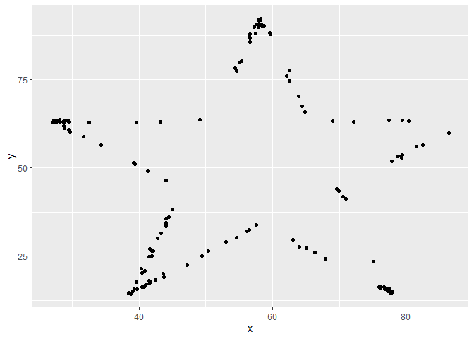
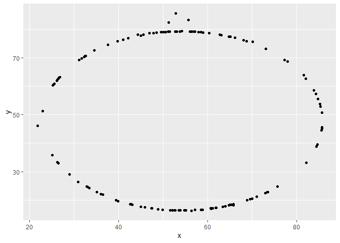

Lab 01 - Hello R
================
Adam Paul
1/21/2022

## Load packages and data

``` r
library(tidyverse) 
library(datasauRus)
```

## Exercises

### Exercise 1

A data frame with 1846 rows and 3 variables (which serve as the
columns). The three variables are ‘dataset’, which indicates which set
the data are from. ‘x-values’ and ‘y-values’.

### Exercise 2

First let’s plot the data in the dino dataset:

``` r
dino_data <- datasaurus_dozen %>%
  filter(dataset == "dino")

ggplot(data = dino_data, mapping = aes(x = x, y = y)) +
  geom_point()
```

<!-- -->

And next calculate the correlation between `x` and `y` in this dataset:

``` r
dino_data %>%
  summarize(r = cor(x, y))
```

    ## # A tibble: 1 x 1
    ##         r
    ##     <dbl>
    ## 1 -0.0645

The correlation is -0.06447185.

### Exercise 3

I began by creating the data frame ‘star\_data’, made by removing all
references to dino in the original code. Specifically, a change was made
in line 47 to ‘star\_data’ and line 48 to ‘star’.

``` r
star_data <- datasaurus_dozen %>%
  filter(dataset == "star")

ggplot(data = star_data, mapping = aes(x = x, y = y)) +
  geom_point()
```

<!-- -->

I adopted the text from above, making the change of swapping ‘dino’ out
for ‘star’. Since the variable names share the same root ’\_data’ I only
swapped out star.

``` r
star_data %>%
  summarize(r = cor(x, y))
```

    ## # A tibble: 1 x 1
    ##         r
    ##     <dbl>
    ## 1 -0.0630

The correlation is -0.0629611.

As a brief aside, it wasn’t until this step that I noticed you wanted
specific commit details. Therefore, this is the first one that has the
proper commit information. It’s also worth noting that I find committing
and pushing via Git desktop a lot more intuitive, and have been doing so
that way. If this is wrong for some reason, please let me know.

### Exercise 4

Below follows the creation of the data frame circle\_data, which
isolates the dataset circle from within datasaurus\_dozen. In the same
chunk, I also create the plot for circle\_data.

``` r
circle_data <- datasaurus_dozen %>%
  filter(dataset == "circle")

ggplot(data = circle_data, mapping = aes(x = x, y = y)) +
  geom_point()
```

<!-- -->

Below, I calculate the correlation for circle\_data.

``` r
circle_data %>%
  summarize(r = cor(x, y))
```

    ## # A tibble: 1 x 1
    ##         r
    ##     <dbl>
    ## 1 -0.0683

The correlation is -0.06834336.

### Exercise 5

Add code and narrative as needed.

To add R chunks either type out the backticks, curly braces, and the
letter `r` or use the Insert chunk button above, green C+.

## Bonus Tips by Yoo Ri

Here are some helpful tips :)

-   filter() is for extracting rows

-   group\_by() is for grouping datasets by assigned column

-   ungroup() cancels the grouping

-   summarize() is often used with group\_by(). This function can print
    the output according to the group\_by().

-   facet\_grid(y\~x,…) creates a grid with variable y as a row,
    variable x as a column  

-   facet\_wrap(x,… ) is useful when there is only one variable
